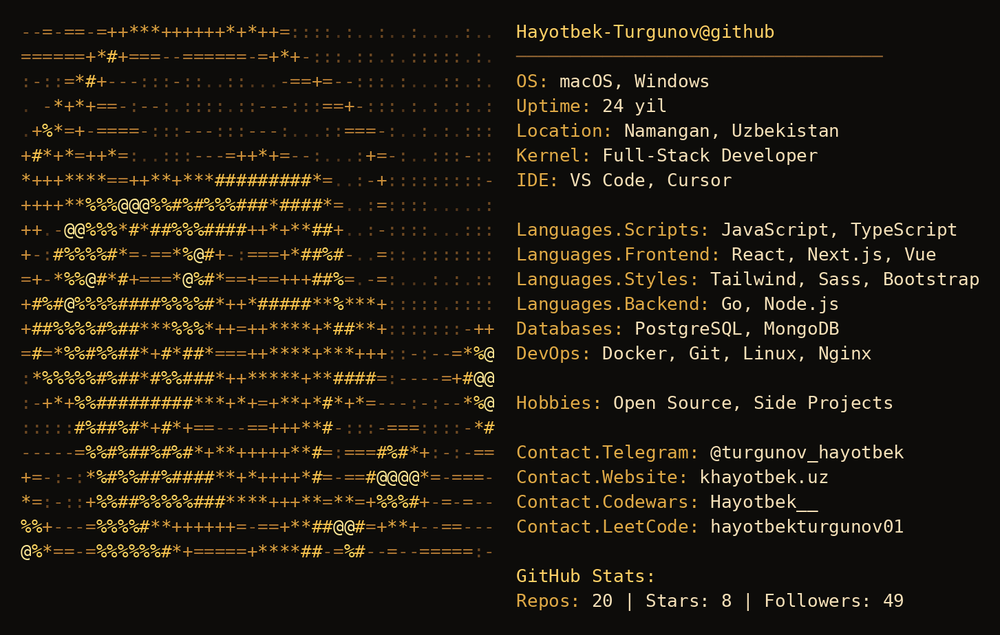

<div align="center">

# 👋 Salom! Men Hayotbek Turgunov

### Full-Stack Developer · Go · Node.js · React · Next.js · Vue

</div>

---

```console
hayotbek@github:~$ neofetch
```

<div align="center">



</div>


---

## 🛠️ Texnologiyalar

<div align="center">

[](https://skillicons.dev)

</div>

---

## 📊 GitHub Statistika

<div align="center">


</div>

<div align="center">

[](https://git.io/streak-stats)

</div>

<div align="center">


</div>

---

## 📈 Contribution Graph

<div align="center">

[](https://github.com/ashutosh00710/github-readme-activity-graph)

</div>

---

## 🏆 Yutuqlar

<div align="center">

[](https://github.com/ryo-ma/github-profile-trophy)

</div>

---

## 🐍 Contribution Snake

<div align="center">


</div>

---

<div align="center">

### 📫 Bog'lanish

[](https://github.com/Hayotbek-Turgunov)
[](https://t.me/turgunov_hayotbek)
[](https://khayotbek.uz)
[](https://www.codewars.com/users/Hayotbek__)
[](https://leetcode.com/u/hayotbekturgunov01/)

</div>
